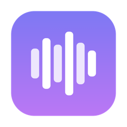
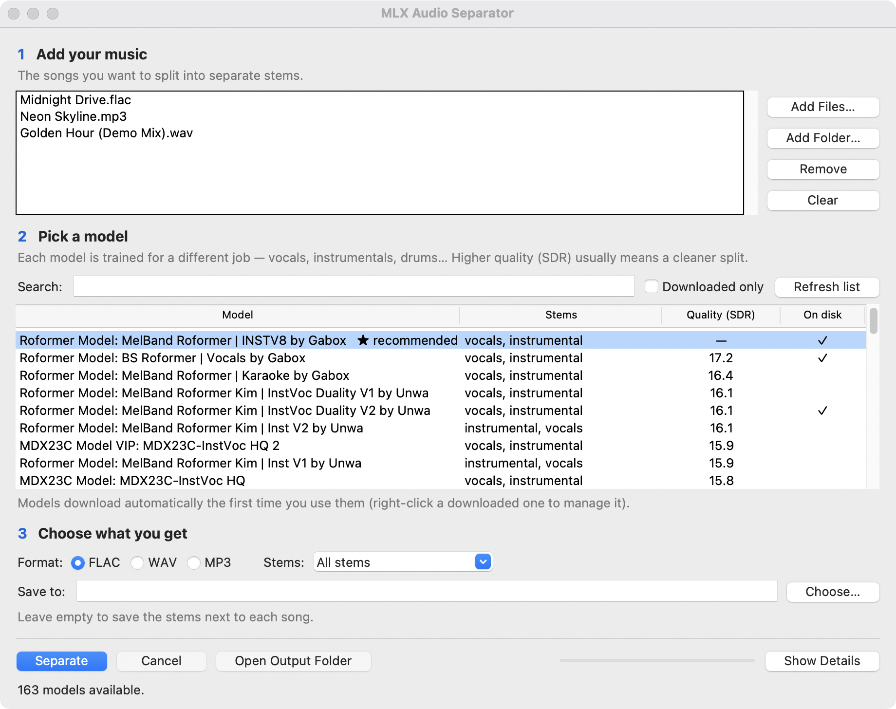

<p align="center">
  
</p>

<h1 align="center">MLX Audio Separator</h1>

<p align="center">
  Split any song into vocals, instrumentals, and stems — free, private, and fast on Apple&nbsp;Silicon.
</p>

<p align="center">
  <a href="LICENSE"></a>
  
  
</p>



## Why you might want this

If you produce, DJ, remix, or sing, you've probably needed a clean acapella or
instrumental of a finished track. Online tools charge per song and make you
upload your music. This app does the same job on your own Mac:

- **Acapellas, instrumentals, drums, bass…** — pick a model, press Separate.
- **Private and free** — your audio never leaves your computer. Processing runs
  on the Apple Silicon GPU via [MLX](https://github.com/ml-explore/mlx).
- **160+ community models** — the same Mel-Band RoFormer / BS-RoFormer /
  MDX23C models used by the stem-separation community, ranked by measured
  quality (SDR). Models download automatically on first use.
- **Batch friendly** — drop in a whole folder, choose FLAC, WAV, or MP3 output.

## Requirements

| What | Why |
| --- | --- |
| Apple Silicon Mac (M1 or newer), macOS 12+ | MLX runs on Apple GPUs only |
| [Python 3.13 from python.org](https://www.python.org/downloads/) | bundles the Tcl/Tk toolkit the GUI needs |
| [Homebrew](https://brew.sh) `ffmpeg` *(recommended)* | MP3/M4A input and MP3 output |

## Install

```bash
git clone https://github.com/fdebkowski/mlx-audio-separator-gui.git
cd mlx-audio-separator-gui
./setup.sh
```

`setup.sh` creates a private Python environment in `~/.venvs/mlx-audio-separator`,
installs the [mlx-audio-separator](https://github.com/ssmall256/mlx-audio-separator)
engine, and builds **MLX Audio Separator.app** into `/Applications`.

> **First launch:** the app is signed ad-hoc, so macOS may warn you. Right-click
> the app → **Open** → **Open** once; after that it opens normally.

## Using the app

1. **Add your music** — click the list (or *Add Files…* / *Add Folder…*) and
   pick the songs to split.
2. **Pick a model** — the ★ recommended model is a great instrumental/vocals
   all-rounder. Higher *Quality (SDR)* usually means a cleaner split; the
   *Stems* column tells you what each model extracts.
3. **Choose what you get** — output format, all stems or just one (e.g.
   *Vocals only*), and where to save. Leave *Save to* empty to put the stems
   next to each song.
4. Press **Separate**. Progress shows in the bar; you can **Cancel** anytime,
   and you'll get a notification when the stems are ready.

Good to know:

- A model downloads once (typically a few hundred MB) and is kept in
  `~/Library/Application Support/MLX Audio Separator/models`. Right-click a
  downloaded model in the list to reveal or delete it.
- A 3–4 minute song typically separates in well under a minute on an M-series
  Mac, after the model is downloaded.
- **Show Details** reveals the full engine log — useful when reporting issues.

## Troubleshooting

| Symptom | Fix |
| --- | --- |
| "Separation engine missing" on launch | Run `./setup.sh` again — the venv at `~/.venvs/mlx-audio-separator` is missing or broken |
| MP3/M4A files fail to load or convert | `brew install ffmpeg` |
| First run stuck on "Downloading model…" | It's fetching the model weights — watch **Show Details** for progress |
| "App can't be opened" warning | Right-click the app → **Open** (ad-hoc signature, see above) |
| Empty model list | Click **Refresh list**; the first fetch needs an internet connection |

## For developers

The GUI is intentionally boring: stdlib-only Python/Tkinter, no runtime
dependencies of its own, all separation delegated to the CLI.

| File | Role |
| --- | --- |
| `app.py` | The whole GUI — a thin Tkinter driver that shells out to the CLI and streams its output into the log/progress UI |
| `runner.py` | Launch shim: fixes `PATH` for Finder-launched apps (so `ffmpeg` resolves) and patches `mlx_audio_io.save` to tolerate 24/32-bit sources |
| `build.sh` | Renders the icon, assembles `MLX Audio Separator.app`, ad-hoc signs it, installs to `/Applications` |
| `make_icon.swift` | Draws the app icon (gradient squircle + equalizer bars) with AppKit |
| `setup.sh` | End-user installer: venv + engine + app build |

Run from source (after `./setup.sh`):

```bash
~/.venvs/mlx-audio-separator/bin/python app.py
```

The app talks to the engine exclusively through the `mlx-audio-separator` CLI
(`--list_models --list_format json` for the catalog, one subprocess per
separation run), so engine upgrades are just `pip install -U` in the venv.

Contributions welcome — see [CONTRIBUTING.md](CONTRIBUTING.md).

## Credits

- [mlx-audio-separator](https://github.com/ssmall256/mlx-audio-separator) by
  ssmall256 — the MLX separation engine this app drives.
- [MLX](https://github.com/ml-explore/mlx) — Apple's array framework for
  Apple Silicon.
- The community researchers who train and share separation models (Gabox,
  unwa, Kim, ZFTurbo, and many others) and the wider
  [audio-separator](https://github.com/nomadkaraoke/python-audio-separator)
  ecosystem their model index comes from.

## License

[MIT](LICENSE). The separation models are downloaded from their authors'
releases and keep whatever license their authors chose.
